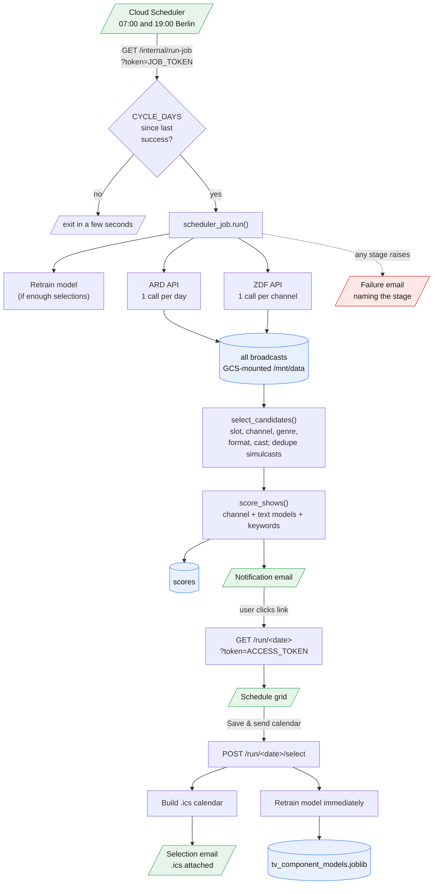

# television-scheduler

The goal of television-scheduler is to scan a week of German public-service TV listings for the handful of shows worth watching. Every cycle the job pulls the schedule straight from the broadcasters' own programme APIs, keeps the programmes that are produced content rather than news or live magazines, scores each one against pre-trained text models (title, description, cast, crew) plus channel preferences and must-watch keywords, and emails a notification with a link to a selection page. Ticking shows and saving produces a calendar file to import and, more importantly, becomes labelled training data: the ranking model retrains immediately after each selection, so every subsequent run reflects the viewer's taste more precisely. All personal data stays in a private Cloud Storage bucket that only this service can read.

## Sources

Listings come from the broadcasters directly, so there is no scraping and nothing to be blocked by.

| Tier | Channels | API | Metadata |
|---|---|---|---|
| ZDF family | ZDF, ZDFneo, ZDFinfo, 3sat, phoenix, ARTE | `api.zdf.de/cmdm/epg` | cast, crew, year, country, genre |
| ARD family | Das Erste, BR, HR, MDR, NDR, Radio Bremen, RBB, SR, SWR, WDR, ONE, KiKA, ARD alpha, tagesschau24 | `programm-api.ard.de` | cast, crew, plus year, country and genre where the subline carries them |

ARTE, 3sat and phoenix appear in both APIs; the ZDF one wins, because it publishes full credits. The ARD API caps the horizon at 8 days, which sets the cycle length. Endpoint shapes were established with reference to [oerc](https://github.com/emschu/oerc) and [zapp-backend](https://github.com/mediathekview/zapp-backend), though both parse a narrower set of fields than this tool needs.

## Data flow



## Layout

```
tvsched/app.py                Flask app: selection grid, settings, job trigger endpoint
tvsched/sources/              broadcaster API clients
  channels.py                 canonical channel names and which API owns each
  ard.py                      ARD listings, teaser credits, subline production data
  zdf.py                      ZDF EPG broadcasts and programme-item details
  collect.py                  runs both sources, normalises to the show record
  fetch.py                    JSON GET with retry and typed source errors
tvsched/candidates.py         reduces a full schedule to the programmes worth ranking
tvsched/ranker.py             RankerConfig, model loading, score_shows()
tvsched/trainer.py            auto-retraining: Ridge regression + TF-IDF
tvsched/db.py                 SQLite schema, additive migrations, data access
tvsched/emailer.py            notification, selection (.ics) and failure emails
tvsched/scheduler_job.py      the scheduled run, stage by stage
scripts/import_historical.py  seeds training data from desktop-app CSV exports
scripts/retrain.py            retrain the model locally, optionally upload to GCS
scripts/run_job_local.py      run one full job cycle locally for testing
ranker_prefs.example.yaml     committed template; ranker_prefs.yaml is gitignored
gcloud_app.yaml               manifest read by the shared ../manage.py orchestrator
env.yaml.example              committed template; env.yaml is gitignored
```

## Setup

```powershell
gcloud auth login
gcloud config set project YOUR_PROJECT
gcloud services enable run.googleapis.com cloudscheduler.googleapis.com `
  storage.googleapis.com artifactregistry.googleapis.com cloudbuild.googleapis.com
```

Copy `env.yaml.example` to `env.yaml` and fill in SMTP settings (a personal Gmail address with a 2FA App Password) plus three random tokens generated with `python -c "import secrets; print(secrets.token_hex(32))"` for `SECRET_KEY`, `ACCESS_TOKEN` and `JOB_TOKEN`. Leave `BASE_URL` as the placeholder until after the first deploy, then paste the printed service URL in and redeploy so the service knows its own address. Running `python ../manage.py` and choosing Install provisions the bucket, service, scheduler and Artifact Registry retention policy from `gcloud_app.yaml`.

Without a pre-trained model the service still works: it ranks by channel preferences and must-watch keywords until enough selections have accumulated to train on.

## Commands

Running `python ../manage.py` with no arguments opens the interactive menu.

| Action | Command |
|---|---|
| Install or update everything from the manifest | `python ../manage.py` |
| Trigger a run manually, respecting the cycle gate | `gcloud scheduler jobs run tvsched-weekly-sched --location=europe-west1` |
| Force a run now, ignoring the cycle gate | `curl "$SERVICE_URL/internal/run-job?token=$JOB_TOKEN&force=1"` |
| Tail logs | `gcloud logging read "resource.type=cloud_run_revision AND resource.labels.service_name=tvsched" --limit=50 --format="table(timestamp, textPayload)"` |
| Update env vars only (no rebuild) | `gcloud run services update tvsched --region=europe-west1 --env-vars-file=env.yaml` |
| Run one job cycle locally | `python scripts/run_job_local.py --skip-email` |
| Seed training data from desktop-app CSVs | `python scripts/import_historical.py --csv-dir "PATH" --db-path data/tv_scheduler.db` |
| Retrain and upload the model | `python scripts/retrain.py --db-path data/tv_scheduler.db --out assets/models/tv_component_models.joblib --upload "gs://YOUR_BUCKET/models/tv_component_models.joblib"` |
| Upload edited preferences | `gcloud storage cp ranker_prefs.yaml gs://YOUR_BUCKET/ranker_prefs.yaml` |

## Which programmes get ranked

The full schedule is stored, but only a slice of it is scored and shown. A broadcast survives five gates, in `tvsched/candidates.py`:

| Gate | Rule |
|---|---|
| Slot | starts inside a configured viewing slot |
| Channel | its `channel_prior` weight is above `-100`, so hiding a channel actually hides it |
| Genre | not news, magazine, documentary, sport, talk, quiz or cabaret |
| Format | not a presented format, meaning the only credited roles are moderation or editorial |
| Fiction | has a **cast**, or failing that an explicitly fictional genre |

**A cast is the sharp signal.** Drama, films and series credit actors; documentaries and news credit a crew and a presenter but no cast. Filtering on cast rather than on credits generally is what separates a film from a documentary, and it lifts cast coverage on the ranked set to 100%.

Finally, simulcasts are collapsed. Radio Bremen carries most of NDR's evening schedule and the regional channels share films, so the same broadcast can appear on several channels at the same minute; the copy on the most preferred channel wins.

Storing everything means the slot boundaries can be widened later and the run rescored without refetching. If the filter ever removes an implausible share of in-slot broadcasts, the run fails loudly rather than quietly emailing a thin guide, on the assumption that source metadata has degraded rather than that the week is genuinely quiet.

## Customising the ranking

User preferences live in a hand-editable YAML file, `ranker_prefs.yaml`, gitignored so personal settings never reach source control. A fresh deploy falls back to the committed `ranker_prefs.example.yaml`. The easiest path is the `/settings` page on the deployed app, which exposes must-watch keywords, channel preferences (name to weight, negative values penalise, large negatives such as `-100` effectively hide a channel), and the three time-slot boundaries; saves write back to the YAML file atomically.

> Channel names must match the canonical names in `tvsched/sources/channels.py` exactly. A name that does not match silently falls back to `default_channel_score` and loses the strongest ranking signal, so every run logs any collected channel that has no weight configured.

The ranker resolves its preferences path in order: `RANKER_PREFS_PATH` (default `/mnt/data/ranker_prefs.yaml`), the legacy `CONFIG_PATH` JSON file if still set, the bundled `ranker_prefs.example.yaml`, then empty defaults.

## Reliability

The job must either deliver a guide or say why it could not, so four layers sit under it.

**Deliver or notify.** Every stage is labelled, and any exception sends a failure email naming the stage, the exception and a link to the logs. That path depends on nothing but the SMTP settings, so it still works when the database, the model or the sources are the thing that broke.

**Degrade instead of aborting.** The two sources are fetched independently. If one fails, the run continues with the other and the notification arrives flagged `[partial]` with a banner naming what is missing. Only a total failure of both stops the run.

**Self-healing schedule.** Cloud Scheduler fires twice a day, but a full run happens only once `CYCLE_DAYS` have passed since the last run that produced scores; otherwise the job exits in a few seconds. A failed cycle therefore costs half a day rather than a whole cycle, and Cloud Scheduler retries three times with backoff on top of that.

**Dead-man's switch.** Two Cloud Monitoring policies watch from outside the app, both built on log-based metrics so they do not depend on the app being able to report anything:

| Policy | Condition | Catches |
|---|---|---|
| `tvsched: run failed` | any occurrence of a logged failure | a run that raised but could not send its own failure email |
| `tvsched: no heartbeat` | no wake-up logged for 23 hours | a paused or deleted schedule, a crash-looping container, a broken revision |

The job logs a heartbeat line every time it wakes, running or skipping. Twice-daily wake-ups give the 23-hour absence window (the Cloud Monitoring maximum) two missed wake-ups of margin, so it signals a real outage rather than timing jitter.

## Common failures

- **A source returns 401 or 403**: treated as a credential problem rather than a transient one and never retried. The ZDF client sends a bearer token that is a public constant taken from the broadcaster's own web player; override it with `ZDF_API_KEY` if it ever rotates.
- **"No model found" in the logs**: the model path is empty; upload a model during setup, or make enough selections through the web UI to trigger an automatic retrain.
- **Selection email arrives but the `.ics` is empty**: the calendar builder prefers the exact `start_utc`/`end_utc` timestamps stored with each broadcast and only falls back to parsing the display strings for rows predating them.
- **A calendar entry's link does not open**: ZDF-family programmes link their public page through the API's sharing-url relation, and ARD programmes link a Mediathek search, because ARD's own deep link 404s whenever a programme is not currently available on demand. Anything without a resolvable page falls back to a search on the broadcaster's site.
- **Ranking looks flat**: check the run log for channels collected without a `channel_prior` weight. Every unweighted channel scores identically, which removes the largest single ranking signal.

## Cost

| Resource | Schedule | Runtime | Monthly |
|---|---|---|---|
| Cloud Run compute | wakes twice daily, full run each cycle | a few seconds when skipping, about a minute when running | a few cents |
| Cloud Storage | continuous | database plus model | a fraction of a cent |
| Cloud Scheduler (1 job) | daily | | ~$0.10 |
| Cloud Build | on redeploy | | a few cents |
| **Total** | | | **well under $1/month** |

> Estimates only, verify current pricing in the Google Cloud console before relying on them.
